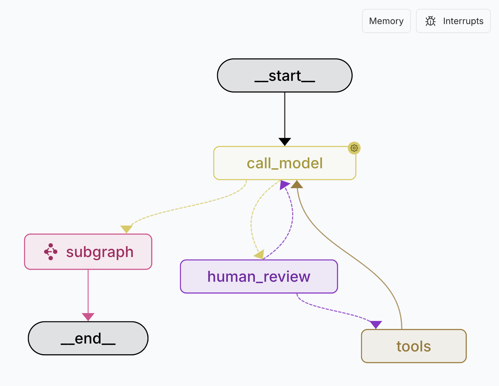
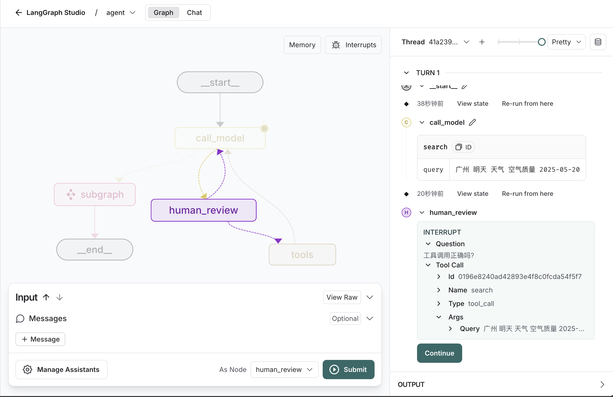

# LangGraph ReAct Agent Testing Template

这个模块是一个 LangGraph ReAct Agent 测试模板，旨在帮助用户快速上手和测试 ReAct Agent 的功能。它提供了一个简单的框架，用户可以在此基础上进行扩展和定制，具备human-in-the-loop和subgraph的能力。




核心逻辑定义在 `src/react_agent/graph.py`, 演示如何使用tools、human-in-the-loop和subgraph的能力。

## 这个图是做什么的？

1. 使用用户的**query**作为输入
2. 通过**graph**推理出一个**action**
3. 使用human-in-the-loop的方式批准**action**
4. 执行**action**，获取action的结果
5. 观察**action**的结果
6. 重复步骤2-5，直到它可以提供一个最终的答案
7. 返回最终的答案，并附加上**subgraph**的结果


## 配置
假定你已经熟悉langgraph的调试工作，如果不熟悉，就去看[LangGraph Platform](https://langchain-ai.github.io/langgraph/concepts/langgraph_platform/)吧。

1. 创建一个 `.env` 文件

```bash
cp .env.example .env
```

2. 在 `.env` 声明你的key

- 大模型API秘钥

```
LLM_API_KEY=your-key
```

- 大模型服务的base_url

```
LLM_BASE_URL=your-key
```

- 使用的大模型
  - MODEL的格式为：{provider}:{model_name}
  - provider可以是openai、deepseek、qwen等，model_name是具体的模型
  - 例如：openai:qwen-plus表示使用OpenAI的qwen-plus模型

```
MODEL=openai:qwen-plus
```


### 运行
一旦`.env` 文件配置完成，你就可以运行这个图了。

> [uv](https://docs.astral.sh/uv/)的按照和使用，请自行查阅文档

```bash
uv run langgraph dev
```

## Human-in-the-loop
在这个图中，我们使用了human-in-the-loop的能力来批准action。你可以在 `src/react_agent/graph.py` 中的`human_review_node`方法中找到这个功能，其中包含了所有human-in-the-loop的逻辑。

当图的执行过程中触发了一个action时，它会调用`human_review_node`方法，并将action的内容传递给它。你可以在这个方法中实现你自己的逻辑来批准或拒绝这个action， 如下图所示：



点击`Continue`按钮，输入用户的反馈，让Agent执行不同的逻辑。

下面是不同的输出的触发逻辑：

### 1. 批准Agent继续执行
。
```json
{
  "action": "continue"
}
```
### 2. 更新Agent要调用的工具参数

**data**字段用于修改工具的参数

```json
{
  "action": "update",
  "data": {"location": "北京"}
}
```
> 这里把查询广州天气的操作修改为了查询北京的

### 3. 使用用户输入的内容作为工具的调用交过
```json
{
  "action": "feedback",
  "data": "广州中到大雪"
}
```
> 这里不调用工具查询，直接使用用户输入的内容作为广州天气查询的结果

### 4. 拒绝调用工具
```json
{
  "action": "reject"
}
```
> 这里不一定输入`reject`，可以输入任何内容，都会拒绝调用工具

## Subgraph子图
这里的子图没有任何实质性的作用，只有演示子图的概念，在整个图执行的最后一步，插入一条AIMessage的子图，来演示子图的能力。

```json
{
  "content": "子图执行完毕，返回主图继续执行",
  "type": "ai",
}
```
